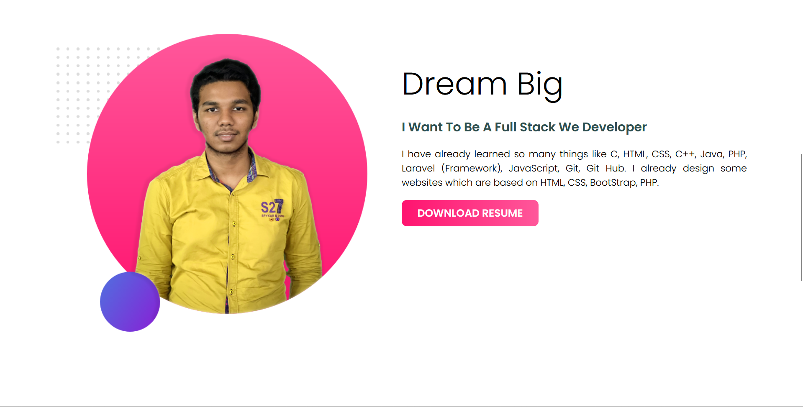
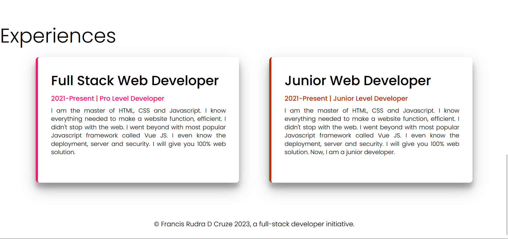

# developers-portfolio

<h2>The full site was divided into 4 section</h2>
<ul>
    <li><a href="index.html/#header">Header Section (Hero Section)</a></li>
    <li><a href="index.html/#dream">Dream Section</a></li>
    <li><a href="index.html/#experiences">Experiences Section</a></li>
    <li><a href="index.html/#footer">Footer Section</a></li>
</ul>

<h3><a href="index.html/#header">Header Section (Hero Section)</a></h3>

<h3><a href="index.html/#header">Dream Section</a></h3>

<h3><a href="index.html/#header">Experiences Section & Footer Section</a></h3>
