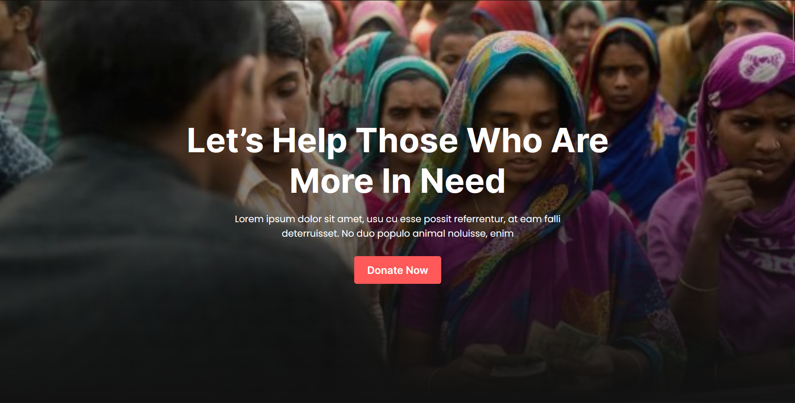
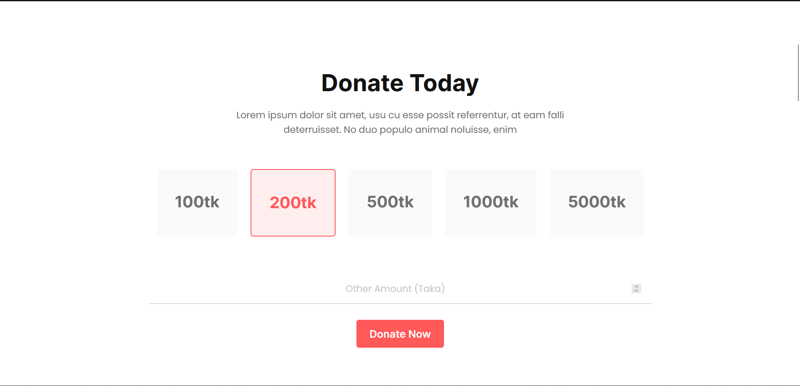
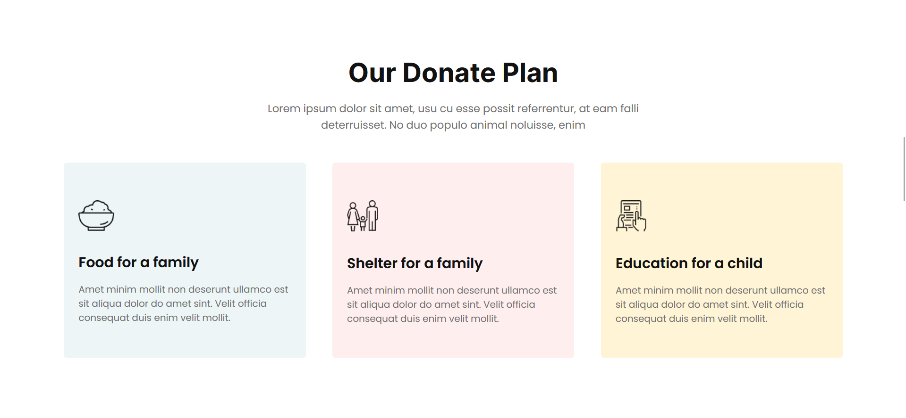
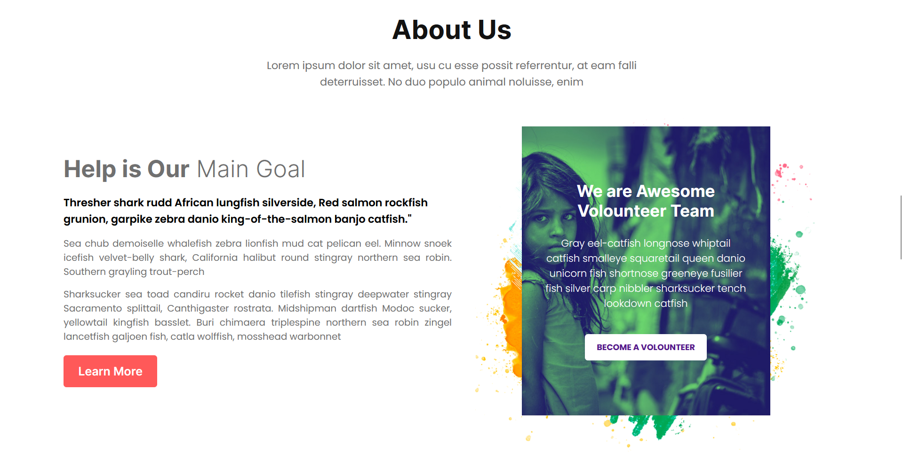
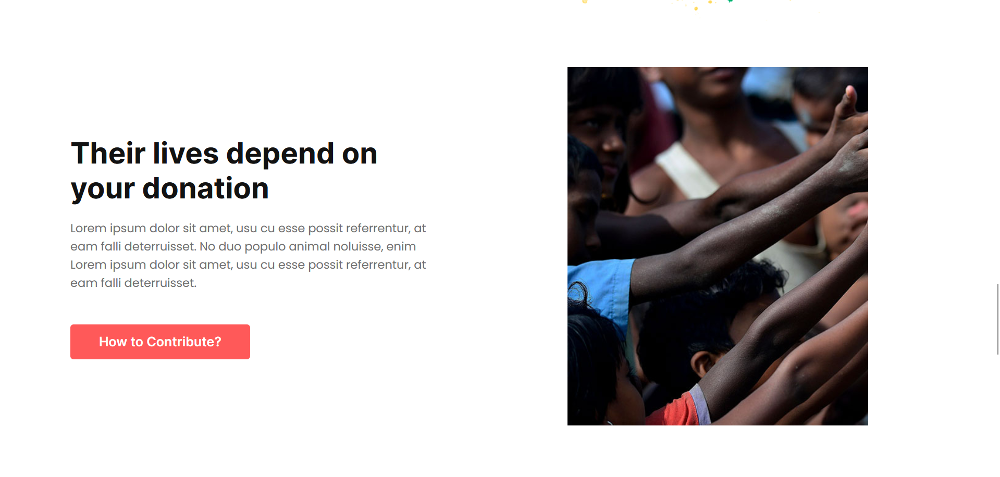
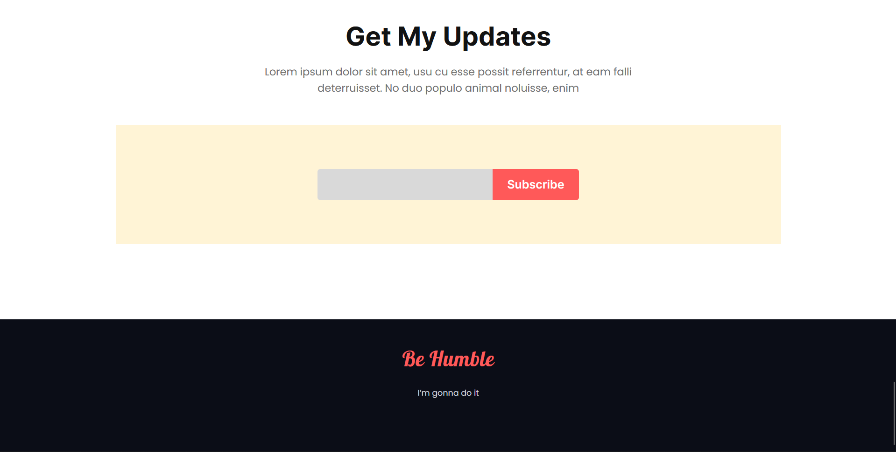

# Donate-Today

<h2>Live Site: <a href="https://rudradcruze.github.io/donate-today/">https://rudradcruze.github.io/donate-today/</a></h2>

This is the basic project or website on donation agency website based of HTML & CSS. This site has some well known eye catchy section. Like

<h2>The full site was divided into 7 section</h2>
<ul>
    <li>
        <a href="rudradcruze.github.io/donate-today/#header">Header Section (Hero Section)</a>
    </li>
    
Basic Header section with some headline text and call to action button.

    <li>
        <a href="rudradcruze.github.io/donate-today/#donate-today">Donate Today Section</a>
    </li>
    
This section is for donate amounts. Some pre-define amounts and custom field for user input.

    <li>
        <a href="rudradcruze.github.io/donate-today/#donate-plan">Donate Plan Section</a>
    </li>
    
This section is for some donation pans. Like food, family, education, house where donation can be possible.

    <li>
        <a href="rudradcruze.github.io/donate-today/#about-us">About Us Section</a>
    </li>
    
About the agency/organization

    <li>
        <a href="rudradcruze.github.io/donate-today/#blog-info">Blog Section</a>
    </li>
    
This section for blog and how to contribute.

    <li>
        <a href="rudradcruze.github.io/donate-today/#get-update">Get Update Section</a>
    </li>
    
This section for news latter.

    <li>
        <a href="rudradcruze.github.io/donate-today/#footer">Footer Section</a>
    </li>
    
This section for footer.

</ul>

<h3>
    <a href="index.html/#header">Header Section (Hero Section)</a>
</h3>

<h3>
    <a href="index.html/#donate-today">Donate Today Section</a>
</h3>

<h3>
    <a href="index.html/#donate-plan">Donate Plan Section</a>
</h3>

<h3>
    <a href="index.html/#about-us">About Us Section</a>
</h3>

<h3>
    <a href="index.html/#blog-info">Blog Section</a>
</h3>

<h3>
    <a href="index.html/#get-update">Get Update & Footer Section</a>
</h3>

