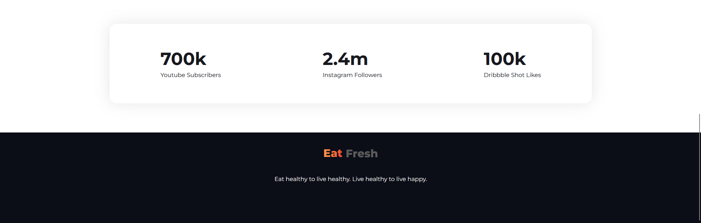

# eat-healthy

<h2>Live Site: <a href="https://rudradcruze.github.io/eat-healthy/">https://rudradcruze.github.io/eat-healthy/</a></h2>

<h2>The full site was divided into 5 section</h2>
<ul>
    <li><a href="rudradcruze.github.io/eat-healthy/#hero">Header Section (Hero Section)</a></li>
    <li><a href="rudradcruze.github.io/eat-healthy/#about-me">About Me Section</a></li>
    <li><a href="rudradcruze.github.io/eat-healthy/#recipie">Recipie Section</a></li>
    <li><a href="rudradcruze.github.io/eat-healthy/#followers">Followers Section</a></li>
    <li><a href="rudradcruze.github.io/eat-healthy/#footer">Footer Section</a></li>
</ul>

<h3>
    <a href="index.html/#hero">Header Section (Hero Section)</a>
</h3>

<h3>
    <a href="index.html/#about-me">About Me Section</a>
</h3>

<h3>
    <a href="index.html/#recipie">Recipie Section</a>
</h3>

<h3>
    <a href="index.html/#followers">Followers & Footer Section</a>
</h3>

